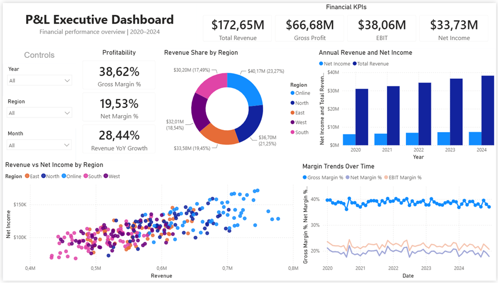

# Profit and Loss Statement Dashboard – Power BI

## Project Overview

This project presents an interactive Power BI dashboard built to analyze a company's Profit and Loss Statement. The goal of the project was to transform financial statement data from a CSV file into a clear business intelligence dashboard showing key financial indicators, trends, and performance insights.

The dashboard helps users quickly understand revenue, costs, profitability, and overall financial performance. It is designed as a portfolio project demonstrating financial data analysis, Power BI dashboarding, KPI reporting, and business interpretation skills.

## Business Problem

A company needs a clear and structured view of its financial performance based on Profit and Loss Statement data. Raw financial data is often difficult to interpret without proper aggregation, visualization, and KPI tracking.

The dashboard was created to answer questions such as:

- What is the company's revenue performance?
- How do costs affect profitability?
- What are the most important financial KPIs?
- How does profit change over time?
- Which areas require management attention?
- What conclusions can be drawn from the Profit and Loss Statement?

## Dataset

The source data was provided as a CSV file containing Profit and Loss Statement information for a company.

The dataset was used to build a Power BI report focused on financial performance analysis, including revenue, expenses, profit, and other key business metrics.

> Note: The source dataset is not included in this repository if it contains private or course-related data. The Power BI file contains the completed dashboard and data model used for analysis.

## Tools and Technologies

- Power BI
- Power Query
- DAX
- Data Modeling
- Financial Analysis
- Business Intelligence
- Data Visualization

## Main Dashboard Features

The dashboard includes visual analysis of key Profit and Loss Statement metrics, such as:

- revenue analysis,
- cost and expense analysis,
- profit analysis,
- profitability indicators,
- financial KPI cards,
- trend analysis,
- comparison of financial categories,
- business interpretation of financial results.

## Key Metrics

The dashboard can include financial KPIs such as:

- Total Revenue
- Total Costs / Expenses
- Gross Profit
- Operating Profit
- Net Profit
- Profit Margin
- Cost-to-Revenue Ratio
- Revenue and Profit Trends

## Analysis Process

The project followed these main steps:

1. Imported the Profit and Loss Statement data from a CSV file.
2. Cleaned and transformed the data in Power Query.
3. Built a data model suitable for financial reporting.
4. Created DAX measures for key financial KPIs.
5. Designed an interactive Power BI dashboard.
6. Added visualizations to support interpretation of company performance.
7. Prepared a business-oriented explanation of the results.

## Dashboard Preview



## Business Insights

The dashboard is designed to support interpretation of financial performance by showing:

- whether revenue is growing or declining,
- how expenses influence profitability,
- which financial categories have the strongest impact on the final result,
- whether the company maintains healthy profit margins,
- how financial performance changes over time,
- which areas may require cost control or further analysis.

## Recommendations

Based on the Profit and Loss Statement analysis, business users can:

- monitor profitability using KPI cards and trends,
- identify periods of weaker financial performance,
- analyze cost structure and its effect on profit,
- compare revenue and expenses over time,
- support management decisions with financial data visualization.

## Repository Structure

```text
profit-and-loss-dashboard-powerbi/
├── README.md
├── profit_and_loss_dashboard.pbix
├── screenshots/
│   └── dashboard_preview.png
└── video/
    └── dashboard_presentation_link.txt
```

## How to Use

1. Download the `.pbix` file from this repository.
2. Open it in Power BI Desktop.
3. Use filters and visuals to explore the company's financial performance.
4. Review KPI cards, charts, and financial trends.
5. Use the dashboard to interpret revenue, costs, profit, and profitability.

## Project Status

Completed as a portfolio Power BI project focused on financial reporting and Profit and Loss Statement analysis.

## Author

Created by Paweł Orłowski

